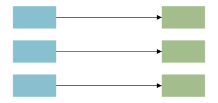

# Connections

Inside a `diagram`, `source -> destination :kind` draws an edge between two shapes (matched by `id`). The optional `:kind` tag is a symbol; the renderer routes the edge based on the diagram's layout and styles it by kind.


```wcl
diagram {
  width = 320  height = 120
  rect { id = a  x = 10.0   y = 10.0  width = 60.0  height = 40.0  fill = "#88c0d0" }
  rect { id = b  x = 200.0  y = 10.0  width = 60.0  height = 40.0  fill = "#a3be8c" }

  a -> b
  a -> b :flow
}
```

## Syntax

| Form | Meaning |
| --- | --- |
| `a -> b` | Edge from the shape with `id = a` to the shape with `id = b` (kind `:default`). |
| `a -> b :flow` | Same edge, tagged with a `:kind` symbol that styles it. |
| ids | Endpoints are matched by each shape's `id`, including ids generated by a `wdoc_repeater` / `wdoc_component` (see below). An id that matches no shape is dropped with a build warning. |

## Generated endpoints

A diagram's `Edge` connection is declared `@dynamic`, so a `->` endpoint may name an id that a `wdoc_repeater` (or `wdoc_component`) produces at render time, not just a literal shape. This is what lets database / ER and class diagrams be data-driven: render each table as a `node_table` whose rows come from a repeater over the data model, then connect specific rows with `->` foreign-key edges.


```wcl
node_table { id = orders  width = 150.0  title = "orders"
  wdoc_repeater { each = ["id", "user_id"]  as = :c
    node_row { id = $"orders_${c}"  p $"${c}: int" }
  }
}
// `orders_user_id` is generated by the repeater, yet addressable:
users_id -> orders_user_id :data
```

Opt a \*custom\* connection schema into the same behaviour with the `@dynamic` decorator; without it, an endpoint that doesn't name a literal block is a `wcl check` error (so static diagrams keep full typo-catching).

```wcl
symbol_set RelKind { default }
@dynamic
connection Ref: &SvgBlock -> &SvgBlock : RelKind
```

## Edge kinds

The built-in `:kind` tags come from the `EdgeKind` symbol set. Each draws the edge with its own styling:



```wcl
a -> b :default   // plain arrow
a -> b :flow      // process-flow styling
a -> b :data      // data-flow styling
```

| Kind | Use |
| --- | --- |
| `:default` | A plain directed edge (the kind when no tag is given). |
| `:flow` | A process / control-flow edge. |
| `:data` | A data-flow edge. |

## Routing

How an edge gets from source to destination is set on the \*diagram\*, not the edge: `routing = :elbow` (default) draws an orthogonal multi-bend polyline that routes around other shapes; `routing = :straight` draws a single direct line. Use `connect_points` on a shape to restrict which sides (`:north`/`:east`/`:south`/`:west`) an edge may attach to.
