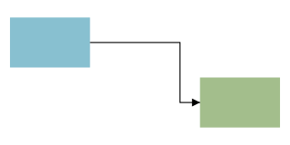

# Diagrams

Diagram blocks are wdoc's way of drawing diagrams and charts on pages. A diagram is made of shapes that break down into primitive shapes and render as SVG, which lets the same source target different backends.

## The diagram block

Diagrams have the following properties that can be set.

| Property | Type | Required | Description |
| --- | --- | --- | --- |
| `width` | `i64` | yes | Diagram canvas width in pixels. |
| `height` | `i64` | yes | Diagram canvas height in pixels. |
| `id` | `identifier` | no | Optional explicit HTML id. |
| `class` | `list<utf8>` | no | Optional style classes. |
| `layout` | `symbol` | no | Layout mode: `:free` (default, manual x/y) / `:grid` / `:layered` / `:force`. |
| `direction` | `symbol` | no | Flow direction for `:layered`: `:top_to_bottom` (default) / `:left_to_right`. |
| `layer_gap` | `f64` | no | Spacing between ranks (layers) in `:layered` layout. |
| `node_gap` | `f64` | no | Spacing between nodes within a rank in `:layered` layout. |
| `cell_width` | `f64` | no | Grid cell width for `:grid` layout. |
| `cell_height` | `f64` | no | Grid cell height for `:grid` layout. |
| `columns` | `i64` | no | Number of columns for `:grid` layout. |
| `gap` | `f64` | no | Gap between cells in `:grid` layout. |
| `iterations` | `i64` | no | `:force` relaxation steps (default 300). |
| `repulsion` | `f64` | no | `:force` node repulsion strength (default 9000). |
| `link_distance` | `f64` | no | `:force` ideal edge-to-edge length (default 60). |
| `gravity` | `f64` | no | `:force` centering pull (default 0.05). |
| `seed` | `i64` | no | `:force` random seed for reproducible layouts (default 1). |
| `routing` | `symbol` | no | Edge routing: `:elbow` (default) / `:straight`. |
| `edge_separation` | `f64` | no | Nudge step that separates parallel edges (default 4). |
| `pan_zoom` | `bool` | no | When `true`, wrap in an interactive viewport with wheel-zoom, drag-pan, and `+`/`−`/`⟲` controls. |
| `zoom_min` | `f64` | no | Minimum zoom scale; `1.0` = fitted view (default 1.0). |
| `zoom_max` | `f64` | no | Maximum zoom scale (default 4.0). |
| `pan_margin` | `f64` | no | Extra overscroll past the content bounds, in px (default 0). |
| `edges` | `list<Edge>` | yes | Edges connecting shapes (`a -> b`). |

#### Child blocks

| Slot | Accepts | Multiple | Description |
| --- | --- | --- | --- |
| `children` | `SvgBlock` | yes | The shapes drawn in the diagram. |

## Pan & zoom

Set `pan_zoom = true` to wrap the diagram in an interactive viewport. Wheel zooms toward the cursor, drag pans, the corner buttons zoom about centre / reset. Zoom is clamped to `[zoom_min, zoom_max]`; pan allows half-a-viewport of overscroll past each content edge plus the author's `pan_margin`. Try it on the diagram below:



```wcl
diagram {
  width = 320  height = 160  pan_zoom = true
  zoom_min = 0.5  zoom_max = 4.0
  rect { id = a  x = 20.0   y = 30.0  width = 80.0  height = 50.0  fill = "#88c0d0" }
  rect { id = b  x = 210.0  y = 90.0  width = 80.0  height = 50.0  fill = "#a3be8c" }
  a -> b
}
```

## Styling shapes with classes

Every shape takes a `class` list, just like text. A `class` emits SVG paint properties — `fill`, `stroke`, `stroke_width`, `stroke_linecap`, `stroke_linejoin`, `opacity` — with `dark { }` / `light { }` overrides, so you style shapes the same way you style prose. Prefer a class over an inline `fill = …` so a shape follows the site theme and the reader's light/dark mode.


```wcl
// Declared at the top level (apply site-wide). Quote hyphenated names.
class "dgm-box" {
  fill         = "#5e81ac"
  stroke       = "#2e3440"
  stroke_width = "2"
  dark  { fill = "#88c0d0"  stroke = "#eceff4" }
  light { fill = "#5e81ac"  stroke = "#2e3440" }
}
class "dgm-ghost" {
  fill    = "#a3be8c"
  opacity = "0.5"
}

diagram { width = 320  height = 120
  rect { x = 20.0   y = 25.0  width = 110.0  height = 70.0  class = ["dgm-box"] }
  rect { x = 160.0  y = 25.0  width = 110.0  height = 70.0  class = ["dgm-ghost"] }
}
```

The SVG paint fields a `class` understands on a shape:

| Field | Effect |
| --- | --- |
| `fill` | Interior colour. |
| `stroke` | Outline colour. |
| `stroke_width` | Outline thickness. |
| `stroke_linecap` / `stroke_linejoin` | Line end / corner style. |
| `opacity` | Overall transparency (`0`–`1`). |
| `dark { }` / `light { }` | Per-colour-scheme overrides. |

Built-in shape classes work the same way — redeclare a quoted name to recolour it everywhere. For example, the chart palette (`wdoc-series-1`..`wdoc-series-8`) or the timeline parts:

```wcl
class "wdoc-series-1" {
  fill   = "#bf616a"
  stroke = "#bf616a"
  dark  { fill = "#d08770" }
}
```
