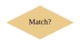
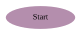
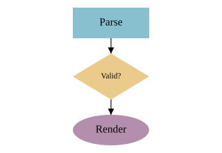

# Flowcharts

Flowchart shapes plus the layered auto-layout mode turn a `diagram` into a flowchart: declare the shapes and the edges, and the renderer ranks them topologically and elbow-routes the connections.

## Flowchart shapes

These stdlib shapes lower to SVG primitives. They differ only in the shape drawn — `process`, `decision`, and `terminator` all take the same fields (shown here for `process`):


### process


A rectangle for an action or step.

```wcl
diagram { width = 160  height = 70
  process "Validate" { x = 20.0  y = 15.0  width = 120.0  height = 40.0  fill = "#88c0d0" }
}
```

### decision



A diamond for a branch — a yes/no test.

```wcl
diagram { width = 160  height = 90
  decision "Match?" { x = 20.0  y = 15.0  width = 120.0  height = 60.0  fill = "#ebcb8b" }
}
```

### terminator



An oval for a start / end node.

```wcl
diagram { width = 160  height = 70
  terminator "Start" { x = 20.0  y = 15.0  width = 120.0  height = 40.0  fill = "#b48ead" }
}
```

## Layered auto-layout

Set `layout = :layered` on the diagram. Shapes are topologically ranked from the connection graph and stacked top-to-bottom; elbow routing then connects them with right-angled paths. `layer_gap` controls the spacing between ranks.



```wcl
diagram {
  width = 320  height = 220  layout = :layered  layer_gap = 20.0

  process    "Parse"  { id = parse   width = 100.0  height = 40.0  fill = "#88c0d0" }
  decision   "Valid?" { id = valid   width = 100.0  height = 60.0  fill = "#ebcb8b" }
  terminator "Render" { id = render  width = 100.0  height = 40.0  fill = "#b48ead" }

  parse -> valid  :flow
  valid -> render :flow
}
```
