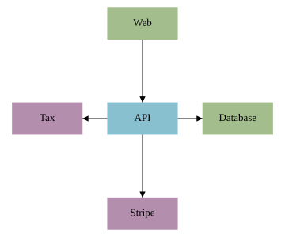
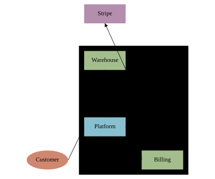

# Flowcharts

Flowchart shapes plus the layered auto-layout mode turn a `diagram` into a flowchart: declare the shapes and the edges, and the renderer ranks them topologically and elbow-routes the connections.

## Flowchart shapes

These stdlib shapes lower to SVG primitives. They differ only in the shape drawn — `process`, `decision`, and `terminator` all take the same fields (shown here for `process`):


### process


A rectangle for an action or step.

```wcl
diagram { width = 160  height = 70
  process "Validate" { x = 20.0  y = 15.0  width = 120.0  height = 40.0  fill = "#88c0d0" }
}
```

### decision


A diamond for a branch — a yes/no test.

```wcl
diagram { width = 160  height = 90
  decision "Match?" { x = 20.0  y = 15.0  width = 120.0  height = 60.0  fill = "#ebcb8b" }
}
```

### terminator


An oval for a start / end node.

```wcl
diagram { width = 160  height = 70
  terminator "Start" { x = 20.0  y = 15.0  width = 120.0  height = 40.0  fill = "#b48ead" }
}
```

## Layered auto-layout

Set `layout = :layered` on the diagram. Shapes are topologically ranked from the connection graph and stacked top-to-bottom; elbow routing then connects them with right-angled paths. `layer_gap` controls the spacing between ranks.


```wcl
diagram {
  width = 320  height = 220  layout = :layered  layer_gap = 20.0

  process    "Parse"  { id = parse   width = 100.0  height = 40.0  fill = "#88c0d0" }
  decision   "Valid?" { id = valid   width = 100.0  height = 60.0  fill = "#ebcb8b" }
  terminator "Render" { id = render  width = 100.0  height = 40.0  fill = "#b48ead" }

  parse -> valid  :flow
  valid -> render :flow
}
```

## Radial (hub-and-spoke) auto-layout

Set `layout = :radial` for an "X and everything it talks to" shape: one shape — the \*hub\* — sits at the centre and every other shape is placed on a ring around it. Name the centre with `hub`; if you omit it, the highest-degree shape wins. A shape's ring is its graph distance from the hub, so direct neighbours form the first circle and second-hop shapes a wider one. Pairs naturally with `routing = :straight` for clean spokes.

This is the layout to reach for when a `:layered` diagram would strand a fan-out of edge-less neighbours in a single line. `ring_gap` sets the spacing added per outer ring; `node_gap` the minimum gap between shapes on a ring; `start_angle` (radians) rotates the ring.



```wcl
diagram {
  width = 360  height = 300  layout = :radial  hub = api  routing = :straight

  process "API"      { id = api    width = 96.0  height = 44.0  fill = "#88c0d0" }
  process "Web"      { id = web    width = 96.0  height = 44.0  fill = "#a3be8c" }
  process "Database" { id = db     width = 96.0  height = 44.0  fill = "#a3be8c" }
  process "Stripe"   { id = stripe width = 96.0  height = 44.0  fill = "#b48ead" }
  process "Tax"      { id = tax    width = 96.0  height = 44.0  fill = "#b48ead" }

  web    -> api :flow
  api    -> db  :flow
  api -> stripe :flow
  api -> tax    :flow
}
```

## Boundaries

A `boundary` draws a labelled box \*behind\* a set of shapes named by id, sized to wherever the layout placed them. Unlike a `container`, it owns no layout — it never moves its members and never joins the solver, so it works on `:radial` and `:force` (where a container can't, because a container runs its own grid/layered layout on its children). This is the C4 "boundary": on a System Context diagram, box the systems you own and leave people and external systems outside it.

List the enclosed shapes in `members` (ids, resolved anywhere in the diagram like edge endpoints). `padding` insets the box from the member bounding box (default 12); `label_pos` places the title (`:top_left` default). Set `stroke` / `fill` to override the themed border, or add a `class`. An id matching no shape is skipped with a build warning. The box is not an obstacle, so edges cross it cleanly.



```wcl
diagram {
  width = 360  height = 300  layout = :radial  hub = platform  routing = :straight

  process    "Platform"  { id = platform  … }
  process    "Warehouse" { id = warehouse … }
  process    "Billing"   { id = billing   … }
  process    "Stripe"    { id = pay        … }
  terminator "Customer"  { id = cust       … }

  cust -> platform :flow     platform -> warehouse :flow
  platform -> billing :flow  billing -> pay :flow

  boundary "Achmisoft" { members = [platform, warehouse, billing] }
}
```
