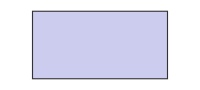
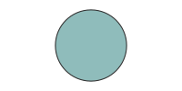
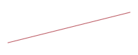
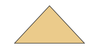
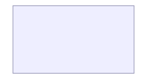

# Primitive Shapes

Primitive shapes are what everything is broken down into for rendering. Higher-level blocks (flowchart nodes, charts, cards, …) all lower to these, so targeting a new backend only means re-implementing the primitives.

Every shape shares a few common fields, summarised here; the per-shape tables below reflect the full field set of each shape:

| Shared field | Meaning |
| --- | --- |
| `id` | Name used to connect the shape (`a -> b`) and to anchor others to it. |
| `class` | Style classes — text and SVG paint (`fill`, `stroke`, …) via the `class` system. |
| `anchor_left` / `anchor_right` / `anchor_top` / `anchor_bottom` | Fractional anchors (0–1) that pin an edge of the shape to the parent box. |
| `connect_points` | Which sides (`:left`/`:right`/`:top`/`:bottom`) edges attach to. |

The box-like shapes — `rect`, `circle`, and `container` — additionally accept an icon badge: `icon` (a `pack.name`), `icon_size`, `icon_pos` (`:center` / `:top_left` / …), and `icon_class`.

## rect



An axis-aligned rectangle — the workhorse box.


```wcl
diagram { width = 200  height = 90
  rect { x = 20.0  y = 15.0  width = 120.0  height = 60.0  fill = "#cce"  stroke = "#333" }
}
```

## circle



A circle, positioned by its centre.


```wcl
diagram { width = 200  height = 100
  circle { cx = 100.0  cy = 50.0  r = 36.0  fill = "#8fbcbb"  stroke = "#333" }
}
```

## line



A straight line segment between two points.


```wcl
diagram { width = 200  height = 80
  line { x1 = 20.0  y1 = 60.0  x2 = 180.0  y2 = 20.0  stroke = "#bf616a" }
}
```

## label


An SVG text label. Named `label` (not `text`) to avoid clashing with the paragraph block.


```wcl
diagram { width = 200  height = 60
  label "Hello" { x = 100.0  y = 36.0  font_size = 22.0  fill = "#5e81ac" }
}
```

## polygon



An arbitrary closed shape from a list of points.


```wcl
diagram { width = 200  height = 100
  polygon { points = "40,80 100,15 160,80"  fill = "#ebcb8b"  stroke = "#333" }
}
```

## container



A grouping box that holds and lays out child shapes (`@children`). Optional chrome makes the group visible; a `layout` arranges the children automatically.


```wcl
diagram { width = 240  height = 130
  container {
    anchor_left = 10.0  anchor_top = 10.0
    fill = "#eef"  stroke = "#88a"  padding = 10.0
    layout = :grid  columns = 2  cell_width = 90.0  cell_height = 44.0  gap = 10.0
    rect { fill = "#88c0d0" }
    rect { fill = "#a3be8c" }
    rect { fill = "#ebcb8b" }
    rect { fill = "#b48ead" }
  }
}
```

## image


A raster image placed as an SVG `<image>`. The source (the inline label) is a doc-relative path — copied into `_wdoc/` — or a URL / `data:` URI passed through unchanged. (The preview above uses an inline `data:` URI so it renders here.)


```wcl
diagram { width = 200  height = 90
  image "logo.png" { x = 50.0  y = 15.0  width = 100.0  height = 60.0 }
}
```

See [Images](../references/wdoc_images.md) for the page-level `` form and asset handling.

## card


A box whose `body` is arbitrary wdoc content (paragraphs, callouts, lists, even nested diagrams), wrapped in an SVG `<foreignObject>` so it scales with the diagram. Timelines accept cards too, pinned to a date with `on`.


```wcl
diagram { width = 260  height = 110
  card { x = 20.0  y = 15.0  width = 220.0  height = 80.0
    title = "Note"
    p "Rich **text** inside a diagram."
  }
}
```
