# Terminal

`terminal` renders a monospace character grid as inline SVG, drawn with a bundled JetBrains Mono Nerd Font. The grid is populated three ways: authored text primitives, an inline ANSI-bearing `text` field, or replay of an `asciinema` recording.

## Authored text

`term_text` is the one base primitive — styled text placed at a 1-based `(row, col)` carrying fg/bg and bold/italic/underline. Higher-level helpers (`term_box`, `term_glyph`, `term_fill`) lower to runs of `term_text`, so the renderer only ever paints styled glyphs. Colours are strings: an ANSI name (`"red"`, `"bright_blue"`), a 256-palette index (`"208"`), or a hex (`"#ff5fd2"`).

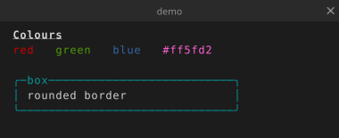

```wcl
terminal {
  cols = 46  rows = 7  title = "demo"
  term_text "Colours" { row = 1  col = 2  bold = true  underline = true }
  term_text "red"     { row = 2  col = 2  fg = "red" }
  term_text "green"   { row = 2  col = 8  fg = "green" }
  term_text "blue"    { row = 2  col = 16  fg = "blue" }
  term_text "#ff5fd2" { row = 2  col = 23  fg = "#ff5fd2" }
  term_box { row = 4  col = 2  width = 32  height = 3  border = :rounded  fg = "cyan"  title = "box" }
  term_text "rounded border" { row = 5  col = 4 }
}
```

## Properties

`terminal` fields:


`term_text` fields:


## Inline text

Set `text = "…"` and the bundled `avt` virtual terminal evaluates it — ANSI sequences, cursor movement, and styling all apply. A bare `\n` becomes a newline. Use this for quick demos of escape codes.

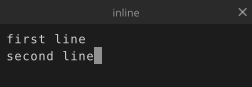

```wcl
terminal {
  cols = 30  rows = 3  title = "inline"
  text = "first line\nsecond line"
}
```

## asciinema replay

Set `source = "rec.cast"` for asciinema replay — frames are coalesced and replayed at the recording's pace (override with `speed`). Playback **stops at the end** (replay glyph in the chrome) unless `loop = true` is set.

```wcl
terminal {
  cols = 80  rows = 24  chrome = true
  source = "casts/demo.cast"
  loop   = true
}
```

## TUI widgets

Inside a `terminal`, stdlib TUI controls compose a small interface. Each widget lowers to runs of `term_text` — the renderer never paints box-drawing characters as vector shapes, only as glyphs on the same character grid as everything else.

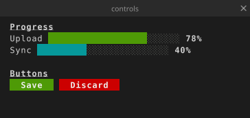

```wcl
terminal {
  cols = 44  rows = 8  title = "controls"
  term_text "Progress" { row = 1  col = 2  bold = true  underline = true }
  tui_progress "Upload" { row = 2  col = 2  value = 78 }
  tui_progress "Sync"   { row = 3  col = 2  value = 40  accent = "cyan" }
  term_text "Buttons" { row = 5  col = 2  bold = true  underline = true }
  tui_button "Save"    { row = 6  col = 2  accent = "green" }
  tui_button "Discard" { row = 6  col = 11  accent = "red" }
}
```

### tui_progress

A two-tone solid-block progress bar. `value` runs from `0` to `max` (default `100`); the optional `@inline` label sits to its left and `show_value` appends a percentage.

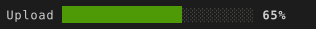

```wcl
tui_progress "Upload" { row = 1  col = 1  value = 65 }
```


### tui_button

A solid accent-fill button. The `@inline` label is centred; `width` pads it, `accent` colours the fill.


```wcl
tui_button "Save" { row = 1  col = 1  accent = "green" }
tui_button "Quit" { row = 1  col = 9  accent = "red" }
```


### tui_spinner

A single static spinner frame — pick the `kind` (`:braille` default, `:circle`, `:line`) and which `frame` to show. An optional `@inline` label follows it.

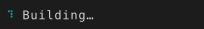

```wcl
tui_spinner "Building…" { row = 1  col = 1  frame = 2 }
```


### tui_input

A single-line text field with a left accent bar. With no `value` the `@inline` placeholder shows muted; `focused = true` draws a cursor.

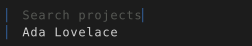

```wcl
tui_input "Search projects" { row = 1  col = 1  focused = true }
tui_input "Name" { row = 2  col = 1  value = "Ada Lovelace" }
```


### tui_dropdown

A labelled drop-down field with a disclosure caret (`▾` closed, `▴` open). Closed, it shows just the selected `text`:

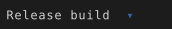

With `open = true` and an `items` list, the options drop down below the field — the one matching `text` (or an explicit `selected` index) is highlighted in the accent colour:

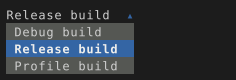

```wcl
tui_dropdown "Release build" { row = 1  col = 1  open = true
  items = ["Debug build", "Release build", "Profile build"]
}
```


### tui_checkbox

An on/off checkbox. `checked = true` fills the marker in the accent colour.

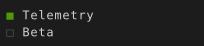

```wcl
tui_checkbox "Telemetry" { row = 1  col = 1  checked = true }
tui_checkbox "Beta" { row = 2  col = 1 }
```


### tui_radio

A radio button — like a checkbox but round; `selected = true` marks the active choice in a group you lay out yourself.

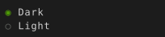

```wcl
tui_radio "Dark"  { row = 1  col = 1  selected = true }
tui_radio "Light" { row = 2  col = 1 }
```


### tui_panel

A bordered container: it draws a box (with an optional `title`) and renders its child controls inset by one cell. Child positions are **relative to the panel**.

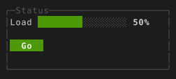

```wcl
tui_panel { row = 1  col = 1  width = 30  height = 6  title = "Status"
  tui_progress "Load" { row = 1  col = 1  value = 50  width = 16 }
  tui_button "Go" { row = 3  col = 1  accent = "green" }
}
```


### tui_group

A borderless container — an optional `title` then its children. Use it to offset a cluster of controls without drawing a box.

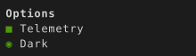

```wcl
tui_group { row = 1  col = 1  title = "Options"
  tui_checkbox "Telemetry" { row = 1  col = 1  checked = true }
  tui_radio "Dark" { row = 2  col = 1  selected = true }
}
```


### Custom widgets

TUI widgets are user-extensible. Declare a `@block("name") type … extends TuiWidget` with a `lower` that returns `list<TermFundamental>`, and it plugs into the renderer like the built-ins — a legal child of any `terminal` (or container). Lay it out from its own top-left `(1, 1)`; the renderer offsets it by the widget's placement. Build the output from the shared `term_run` / `term_repeat` helpers, since styled text is the only thing the renderer paints — colour over box characters.

Here's a `kbd` keycap — a coloured background run with the key label on top, the accent overridable per instance:

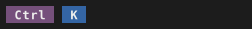

```wcl
// Extends TuiWidget → a legal terminal child. The lower returns styled
// text runs (a background of spaces + the label on top).
@block("kbd")
type Kbd extends TuiWidget {
  @inline(0) key: utf8
  accent: utf8?
  row: i64  col: i64
  lower = fn(k: Kbd) -> list<TermFundamental> {
    let acc = if k.accent == none { "magenta" } else { k.accent };
    let w = len(k.key) + 2;
    [
      term_run(term_repeat(" ", w), 1, 1, none, acc, none),
      term_run(k.key, 1, 2, "bright_white", acc, true),
    ]
  }
}

terminal { cols = 30  rows = 1  chrome = false
  kbd "Ctrl" { row = 1  col = 1 }
  kbd "K"    { row = 1  col = 8  accent = "blue" }
}
```
