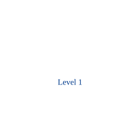

# Tilemaps

A `tilemap` draws a 2D grid of indexed tiles cropped from a shared spritesheet. Author it numerically (a list of int rows) or symbolically via a glyph legend.

## Declaring a tileset

`tileset` names a spritesheet image plus its slice geometry, and hangs off the document root (like `iconset`). The sheet's pixel dimensions are read from the image header at build time (PNG / JPEG / GIF); set `image_width` / `image_height` to override. Tile index N maps to sheet column `N % columns`, row `N / columns`.

```wcl
tileset platformer {
  source      = "assets/kenney-platformer.png"
  tile_width  = 64
  tile_height = 64
  columns     = 5
}
```

| Property | Type | Required | Description |
| --- | --- | --- | --- |
| `name` | `identifier` | yes | Reference name (the inline label), e.g. `dungeon`. |
| `source` | `utf8` | yes | Image path, relative to the build entry file. |
| `tile_width` | `i64` | yes | Source tile pixel width. |
| `tile_height` | `i64` | yes | Source tile pixel height. |
| `columns` | `i64` | no | Tiles per sheet row — maps an index to a coordinate (auto-fit from the sheet width otherwise). |
| `margin` | `i64` | no | Pixel border around the whole sheet (default `0`). |
| `spacing` | `i64` | no | Pixel gap between tiles (default `0`). |
| `image_width` | `i64` | no | Override the auto-detected sheet pixel width. |
| `image_height` | `i64` | no | Override the auto-detected sheet pixel height. |

## Symbolic maps

For map-like authoring, declare a glyph legend with `tile` children and supply `map` — a list of utf8 rows. Each character resolves through the legend to a tile index; an unmapped glyph (here `.`) draws nothing, so the page shows through. The tilemap is a diagram shape, so anything drawn after it overlays on top.



```wcl
diagram { width = 280  height = 230
  tilemap {
    set   = "platformer"
    scale = 0.5
    tile "#" { index = 25 }   // brown crate — ground
    tile "~" { index = 1 }    // water surface
    tile "=" { index = 6 }    // deep water
    tile "T" { index = 16 }   // torch
    tile "G" { index = 28 }   // grass tuft
    tile "r" { index = 27 }   // rock
    map = [
      "........",
      "........",
      ".T.G..r.",
      "########",
      "~~~~~~~~",
      "========",
    ]
  }
  // Overlaid after the tilemap, so it sits over the tiles.
  label "Level 1" { x = 128.0  y = 146.0  font_size = 16.0  fill = "#003a8c" }
}
```

## Numeric tiles

The same data can be written as raw index rows with `tiles` (one inner list per row). `-1` — the default `empty` index — leaves a cell blank. Here a single row doubles as a tile palette.


```wcl
diagram { width = 320  height = 44
  tilemap {
    set   = "platformer"
    scale = 0.6
    tiles = [
      [ 25, 9, 1, 6, 16, 28, 27, 37 ],
    ]
  }
}
```

## Fields

| Property | Type | Required | Description |
| --- | --- | --- | --- |
| `set` | `identifier` | yes | Name of the `tileset` to slice from. |
| `tiles` | `list<list<i64>>` | no | Numeric grid — `list<list<i64>>`, one inner list per row. |
| `map` | `list<utf8>` | no | Symbolic grid — `list<utf8>` rows resolved through the `tile` legend (wins over `tiles`). |
| `empty` | `i64` | no | Index meaning "no tile" (default `-1`). |
| `scale` | `f64` | no | Display scale (default `1.0`). |
| `smooth` | `bool` | no | Anti-alias instead of the default `image-rendering: pixelated`. |
| `x` | `f64` | no | Position x within the enclosing `diagram` / `container`. |
| `y` | `f64` | no | Position y within the enclosing `diagram` / `container`. |
| `id` | `identifier` | no | Optional explicit HTML id. |
| `class` | `list<utf8>` | no | Optional style classes. |
| `anchor_left` | `f64` | no | Diagram anchor insets (left/right/top/bottom), like any `SvgBlock`. |
| `connect_points` | `list<AnchorSide>` | no | Diagram edge-attach sides, like any `SvgBlock`. |

#### Child blocks

| Slot | Accepts | Multiple | Description |
| --- | --- | --- | --- |
| `legend` | `tile` | yes | Glyph legend — `tile "#" { index = N }` entries mapping a glyph to a tile index. |

`scale` sizes the display; `image-rendering: pixelated` is the default (via the always-injected `TILEMAP_CSS`), and `smooth = true` opts into the browser's default smoothing. The sheet is copied to `_wdoc/`, so tiles resolve when served.

> [!NOTE]
> **Asset credit**
> The sample spritesheet is Kenney's "Platformer Pack" (64×64 tiles), released under CC0 (public domain). Browse the packs at [kenney.nl/assets](https://kenney.nl/assets).
