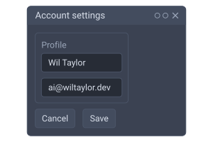
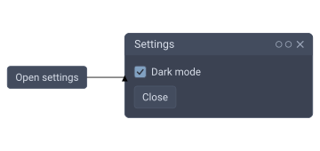
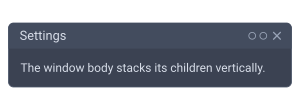
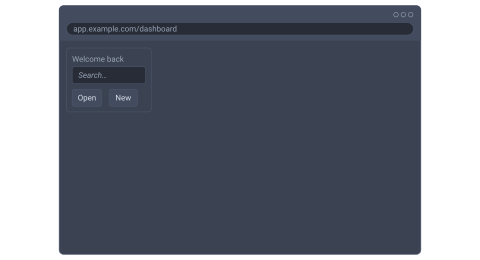
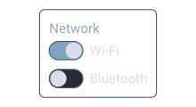
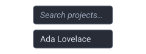
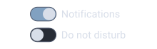

# Wireframe

Wireframe widgets mock up a UI — windows, device frames (browser / phone / tablet), panels, inputs, controls — as **diagram shapes**. Each `wf_*` block `extends SvgBlock`, so it lives inside a `diagram`: you place it with `x` / `y` (or anchors), connect widgets with edges, and mix them with any other shape. Container widgets nest other widgets, so you compose a window of panels of rows of controls; the whole group is sized by its content and the diagram just frames it. They're visual mockups — static SVG, not interactive.

Here's a full window composed of a panel and a button row, framed by a diagram:



```wcl
diagram {
  width = 300  height = 200
  wf_window "Account settings" {
    wf_panel { title = "Profile"
      wf_input "Display name" { value = "Wil Taylor" }
      wf_input "Email"        { value = "ai@wiltaylor.dev" }
    }
    wf_row {
      wf_button "Cancel"
      wf_button "Save" { icon = "lucide.check" }
    }
  }
}
```

## Placing and connecting widgets

Because widgets are diagram shapes, you place them by `x` / `y` and draw edges between them by `id` — just like connecting any two shapes. A widget is sized by its content, so you only position the top-left corner.



```wcl
diagram {
  width = 360  height = 170
  wf_button "Open settings" { id = launch  x = 20.0  y = 65.0 }
  wf_window "Settings" {
    id = win  x = 180.0  y = 20.0
    wf_checkbox "Dark mode" { checked = true }
    wf_button "Close"
  }
  launch -> win
}
```

Under an auto-layout `diagram` (`layout = :layered` / `:force`), widgets are sized by their measured content and placed by the solver — omit `x` / `y` and let the layout flow them.

## Containers

Every container takes `@children(Widget)` — drop any other widget inside, nested arbitrarily. The Rust renderer measures and lays the children out internally (their `x` / `y` are ignored; only the root widget's placement positions the whole group).

### wf_window

The outer chrome: a titlebar (with traffic-light controls, hidden by `controls = false`) over a body that hosts other widgets.



```wcl
diagram {
  width = 300  height = 110
  wf_window "Settings" {
    wf_label "The window body stacks its children vertically."
  }
}
```


### wf_browser

A web-browser frame: a toolbar with traffic-light dots and an address bar (the inline label is the URL) over a content area that hosts other widgets. Drop a `wf_window` or any controls inside to mock up a web app.



```wcl
diagram { width = 480  height = 260
  wf_browser "app.example.com/dashboard" {
    wf_panel { title = "Welcome back"
      wf_input "Search…"
      wf_row {
        wf_button "Open"
        wf_button "New" { icon = "lucide.check" }
      }
    }
  }
}
```

Unlike the other widgets — sized to their content — the device frames have a realistic **fixed** default size (`wf_browser` is 640 × 440) so the content sizes inside them properly. An explicit `width` / `height` pins that axis (the other keeps the device default), and the height still grows if the content would overflow.


### wf_phone

A phone shell — a bezel around a screen with a status bar (the inline label is an optional caption) and a home-indicator pill. Set `orientation = :landscape` to rotate it; the default is `:portrait` (280 × 580, swapped in landscape).


```wcl
diagram { width = 320  height = 480
  wf_phone "9:41" {
    wf_panel { title = "Account"
      wf_input "Email" { value = "ada@example.com" }
      wf_toggle "Notifications" { on = true }
    }
    wf_button "Sign in" { icon = "lucide.check" }
  }
}
```


### wf_tablet

A tablet shell — the same chrome as `wf_phone` on a larger, squarer frame (480 × 640 portrait). Shown here in landscape:


```wcl
diagram { width = 460  height = 320
  wf_tablet { orientation = :landscape
    wf_row {
      wf_panel { title = "Library"
        wf_label "Recent"
        wf_label "Favourites"
      }
      wf_panel { title = "Reader"
        wf_label "Select an item to read."
      }
    }
  }
}
```


### wf_panel

A bordered group with an optional `title` caption — use it to box a set of related controls.



```wcl
diagram { width = 220  height = 120
  wf_panel { title = "Network"
    wf_toggle "Wi-Fi" { on = true }
    wf_toggle "Bluetooth"
  }
}
```


### wf_row

Lay children out **horizontally** (a panel / window body stacks vertically by default).


```wcl
diagram { width = 320  height = 50
  wf_row {
    wf_button "Back"
    wf_button "Next"
    wf_button "Finish" { icon = "lucide.check" }
  }
}
```


### wf_column

Stack children **vertically** — the default flow, useful for an explicit column inside a `wf_row` or `wf_grid`.


```wcl
diagram { width = 220  height = 80
  wf_column {
    wf_label "Name"
    wf_input "Full name"
  }
}
```


### wf_grid

A grid of equal-width columns; `columns` sets the count and children flow across the rows.



```wcl
diagram { width = 280  height = 120
  wf_grid { columns = 3
    wf_button "1"
    wf_button "2"
    wf_button "3"
    wf_button "4"
    wf_button "5"
    wf_button "6"
  }
}
```


## Controls

### wf_label

A plain text label.


```wcl
diagram { width = 220  height = 30
  wf_label "Just some label text."
}
```


### wf_button

A button caption, with an optional leading `icon` (any `pack.name`, e.g. `"lucide.check"`).


```wcl
diagram { width = 320  height = 50
  wf_row {
    wf_button "Save" { icon = "lucide.check" }
    wf_button "Cancel"
    wf_button "Delete" { disabled = true }
  }
}
```


### wf_input

A text field. With no `value` the `@inline` placeholder shows greyed; a `value` fills it with solid text.


```wcl
diagram { width = 240  height = 90
  wf_column {
    wf_input "Search projects…"
    wf_input "Name" { value = "Ada Lovelace" }
  }
}
```


### wf_dropdown

A select field showing the currently-chosen option label with a chevron.


```wcl
diagram { width = 200  height = 44
  wf_dropdown "Release build"
}
```


### wf_checkbox

An on/off checkbox; `checked = true` fills the box with a tick.


```wcl
diagram { width = 240  height = 70
  wf_column {
    wf_checkbox "Enable telemetry" { checked = true }
    wf_checkbox "Join the beta"
  }
}
```


### wf_radio

A radio button — like a checkbox but round; mark the active one with `selected = true` in a group you lay out yourself.


```wcl
diagram { width = 160  height = 70
  wf_column {
    wf_radio "Dark" { selected = true }
    wf_radio "Light"
  }
}
```


### wf_toggle

A sliding on/off switch with an optional trailing label; `on = true` slides the knob across.


```wcl
diagram { width = 220  height = 70
  wf_column {
    wf_toggle "Notifications" { on = true }
    wf_toggle "Do not disturb"
  }
}
```


## Common fields

Every widget extends a shared `Widget` interface — its diagram placement geometry (`x` / `y` / anchors / `connect_points`) plus the per-element theming hints:


## Custom widgets

Wireframe widgets are user-extensible diagram shapes. Declare a `@block("name") type … extends Widget` with a `lower` that returns `list<SvgFundamental>`, and it plugs into the diagram render path like any custom shape — placed directly in a `diagram` by its own `x` / `y` and connectable by edges. (The built-in containers only lay out the built-in widgets, so a custom widget renders as a standalone shape, not nested inside a `wf_window`.)

Here's a coloured status `wf_badge`. The `lower` reads its `x` / `y` and emits a filled box with a centred label — exactly how the built-in `process` shape lowers — and a `fill` field recolours an individual instance:



```wcl
// Extends Widget → a diagram shape. The lower returns SVG fundamentals
// positioned at the widget's own x/y (like the built-in `process`), and a
// `fill` field recolours a single instance.
@block("wf_badge")
type WfBadge extends Widget {
  @inline(0) text: utf8
  fill = "#2e7d32"
  id: identifier?  class: list<utf8>?  disabled: bool?
  x = 0.0  y = 0.0  width = 96.0  height = 26.0
  anchor_left: f64?  anchor_right: f64?  anchor_top: f64?  anchor_bottom: f64?
  connect_points: list<AnchorSide>?
  theme: symbol?  accent: symbol?  mode: symbol?
  lower = fn(b: WfBadge) -> list<SvgFundamental> {
    [ SvgFundamental::Rect {
        x: b.x, y: b.y, width: b.width, height: b.height,
        fill: b.fill, class: b.class,
      },
      SvgFundamental::Label {
        content: b.text,
        x: b.x + b.width / 2.0,
        y: b.y + b.height / 2.0 + 4.0,
        fit_width: b.width, fit_height: b.height,
        fill: "#ffffff",
      } ]
  }
}

diagram {
  width = 320  height = 40
  wf_badge "passing" { x = 12.0  y = 7.0 }
  wf_badge "failing" { x = 130.0 y = 7.0  fill = "#c62828" }
}
```
