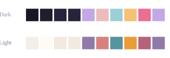

# Rosé Pine theme

`theme = :rose` — muted rose. Dark (top) and light (bottom): page, surface, border, accent, accent-2, tip, warn, danger, keyword. See [all themes](../references/fact_themes.md).

## Related

- [Built-in colour themes](../references/fact_themes.md) — Built-in colour themes supports Rosé Pine theme: Set `theme = :<name>` on a `site` to recolour the whole site in one line.

[← Back to SKILL.md](../SKILL.md)
